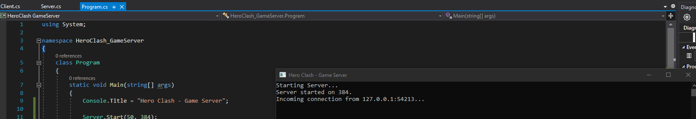

# Devlog 01 - Networking, Heros, Abilities!
#### Date: (07/11/21 - 07/18/21)

### Monday:

I started by creating my first Server in C#

After I completed the console I kept on working on the game and I finished
TCP and UDP connections between server and client!

I finished the day by creating a player controller.

### Tuesday:

I started working on the Interpolation and Ticking system and didn't get too far.

### Wednesday:

I converted my server to a Unity Project and I also finished the Ticking system and continued working on interpolation.

At this point the Interpolation was working other then the server keeps on slingshotting the player every tick.

### Thursday:

I thought I finished interpolation, but sure boy, I was wrong.

It was working in single player, but whenever I host a multiplayer server it slingshotted the other player across the galaxy.

## Friday:

I got most of the interpolation fixed exept every time you move it slingshots the player.

[Interpolation Bug](https://vimeo.com/576414622)

### Saturday:

I decided to put Interpolation on hold for now since it was taking up many days and I wanted to get more Core Mechanics done.

Today I added Hero Chosing Systems, Added Shooting, Hero Movement, Implemented the first hero (Wizzo), Added Abilities, and Added Headshots to the game.

### Sunday:

I decided to take today off