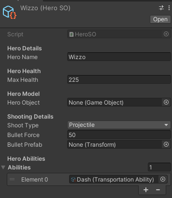

# Devlog 01 - Networking, Heros, Abilities!
#### Date: (08/11/21 - 08/19/21)

### Wednesday:

I fixed the interpolation bug where it slingshots the player. I decided to rewrite the entire game, but I decided to make it so it only implements singlplayer for the time being.

### Thursday:

I decided to make heros and abilities be Scriptable Objects instead of MonoBehaviors

### Friday:

I made abilities and made them so they are easily interchangable.

### Rest of the time:

I have been setting up a datastore with <b>Firebase</b> and making player accounts so I can make a new account from this website!